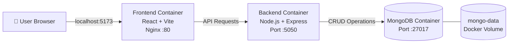

<div align="center">

# 🚀 MERN Stack Application with Docker Compose

### A containerized full-stack MERN application using Docker, Docker Compose, Nginx, Node.js, Express, React, and MongoDB

**MongoDB • Express.js • React • Node.js • Docker • Docker Compose • Nginx**

</div>

---

## 📌 Project Description

This project demonstrates how to **containerize and run a complete MERN stack application using Docker and Docker Compose**.

The application consists of three main services:

- **Frontend** — React application built using Vite and served using Nginx
- **Backend** — Node.js and Express REST API
- **Database** — MongoDB for persistent application data

Each component runs inside its own Docker container.

Docker Compose is used to orchestrate all the containers, create the required Docker network, expose application ports, and provide persistent storage for MongoDB.

The main objective of this project is to understand how a multi-tier application can be containerized and managed using Docker Compose.

---

## 🏗️ Project Architecture



### Architecture Flow

```text
User Browser
     │
     │ http://localhost:5173
     ▼
┌────────────────────────────┐
│     Frontend Container     │
│                            │
│       React + Vite         │
│                            │
│      Served by Nginx       │
│       Container :80        │
└─────────────┬──────────────┘
              │
              │ API Request
              ▼
┌────────────────────────────┐
│      Backend Container     │
│                            │
│    Node.js + Express.js    │
│       Port :5050           │
└─────────────┬──────────────┘
              │
              │ Database Operations
              ▼
┌────────────────────────────┐
│      MongoDB Container     │
│                            │
│       Port :27017          │
│                            │
│   Persistent Docker Volume│
└────────────────────────────┘
```

---

## ⚙️ How the Application Works

The user accesses the application through:

```text
http://localhost:5173
```

Docker Compose maps:

```text
Host Port 5173
      ↓
Frontend Container Port 80
      ↓
Nginx
      ↓
React Application
```

The React frontend communicates with the backend API.

The backend runs on:

```text
localhost:5050
```

The backend communicates with MongoDB for storing and retrieving application data.

MongoDB runs on:

```text
localhost:27017
```

All containers communicate through the Docker bridge network:

```text
mern_network
```

MongoDB data is stored using the persistent Docker volume:

```text
mongo-data
```

This ensures that the database data remains available even if the MongoDB container is stopped or recreated.

---

## 🛠️ Tech Stack

| Technology | Purpose |
|---|---|
| **MongoDB** | NoSQL database |
| **Express.js** | Backend web framework |
| **React** | Frontend user interface |
| **Node.js** | Backend runtime |
| **Vite** | React build tool |
| **Nginx** | Serves the production frontend |
| **Docker** | Containerizes application components |
| **Docker Compose** | Orchestrates multiple containers |
| **Docker Network** | Enables communication between containers |
| **Docker Volume** | Provides persistent MongoDB storage |

---

## 🐳 Docker Architecture

This project contains three Docker services:

| Service | Container Port | Host Port | Purpose |
|---|---:|---:|---|
| **Frontend** | `80` | `5173` | React application served by Nginx |
| **Backend** | `5050` | `5050` | Node.js / Express API |
| **MongoDB** | `27017` | `27017` | Application database |

All services are connected through:

```text
mern_network
```

MongoDB uses:

```text
mongo-data
```

for persistent database storage.

---

## 📂 Project Structure

```text
MERN-stack-docker-compose/
│
├── mern/
│   │
│   ├── frontend/
│   │   ├── Dockerfile
│   │   ├── package.json
│   │   └── ...
│   │
│   └── backend/
│       ├── Dockerfile
│       ├── package.json
│       └── ...
│
├── images/
│
├── docker-compose.yaml
├── .gitignore
└── README.md
```


# 🚀 Running the Application

The application can be started either manually using Docker commands or by using Docker Compose.

---

## 🔹 Create a network for the Docker containers

```bash
docker network create mern
```

---

## 🔹 Build the Client

```bash
cd mern/frontend
docker build -t mern-frontend .
```

---

## 🔹 Run the Client

```bash
docker run --name=frontend --network=mern -d -p 5173:5173 mern-frontend
```

---

## 🔹 Verify the Client is Running

Open your browser and type:

```text
http://localhost:5173
```

---

## 🔹 Run the MongoDB Container

```bash
docker run --network=mern --name mongodb -d -p 27017:27017 -v ~/opt/data:/data/db mongo:latest
```

---

## 🔹 Build the Server

```bash
cd mern/backend
docker build -t mern-backend .
```

---

## 🔹 Run the Server

```bash
docker run --name=backend --network=mern -d -p 5050:5050 mern-backend
```

---

# 🐳 Using Docker Compose

Instead of creating and managing each container manually, Docker Compose can start the complete MERN stack using a single command.

From the root directory of the project:

```bash
docker compose up -d
```

Docker Compose automatically:

```text
Builds Frontend Image
        │
        ├──────────────┐
        │              │
        ▼              ▼
Starts Frontend    Builds Backend Image
                       │
                       ▼
                  Starts Backend
                       │
                       ▼
                  Starts MongoDB
                       │
                       ▼
                  Creates Network
                       │
                       ▼
                  Creates Volume
```

---

## 🔍 Check Running Containers

```bash
docker compose ps
```

or:

```bash
docker ps
```

You should see the frontend, backend, and MongoDB containers running.

---

## 🌐 Access the Application

Once all containers are running:

### Frontend

```text
http://localhost:5173
```


## 💡 What This Project Demonstrates

This project demonstrates practical knowledge of:

- Containerizing frontend and backend applications
- Creating multi-stage Dockerfiles
- Serving React applications using Nginx
- Running MongoDB inside a container
- Creating persistent Docker volumes
- Docker container networking
- Port mapping
- Managing dependencies between services
- Orchestrating multiple containers using Docker Compose
- Running a full-stack application using a single Docker Compose command

---

## 🎯 Project Workflow

```text
Application Source Code
        │
        ▼
   Dockerfiles
        │
        ▼
   Docker Images
        │
        ▼
 docker-compose.yaml
        │
        ▼
 ┌─────────────────────┐
 │   Docker Containers │
 │                     │
 │  ┌───────────────┐  │
 │  │   Frontend    │  │
 │  └───────────────┘  │
 │          │          │
 │          ▼          │
 │  ┌───────────────┐  │
 │  │    Backend    │  │
 │  └───────────────┘  │
 │          │          │
 │          ▼          │
 │  ┌───────────────┐  │
 │  │    MongoDB    │  │
 │  └───────────────┘  │
 │                     │
 └─────────────────────┘
        │
        ▼
  MERN Application
```

---

## 👨‍💻 Author

**Ramasubramanian**

Aspiring **DevOps / Cloud Engineer**

This project was created as part of my hands-on DevOps learning journey to understand application containerization and multi-container orchestration using Docker and Docker Compose.

---

<div align="center">

### ⭐ MERN Stack + Docker + Docker Compose

**Containerize • Connect • Orchestrate • Deploy**

</div>
